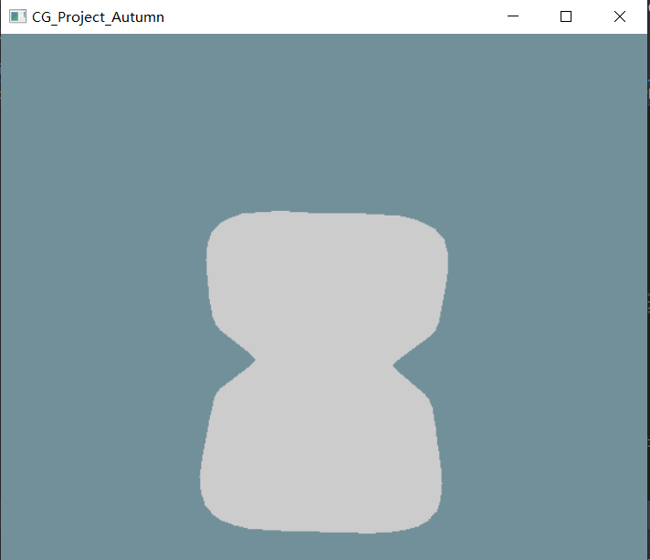

# 扫描线zbuffer和区间扫描线

<!-- @import "[TOC]" {cmd="toc" depthFrom=2 depthTo=4 orderedList=false} -->

<!-- code_chunk_output -->

- [开发环境](#开发环境)
- [依赖库](#依赖库)
- [实现功能](#实现功能)
- [数据结构](#数据结构)
  - [模型处理](#模型处理)
    - [基础结构](#基础结构)
    - [模型存储结构](#模型存储结构)
  - [基础变量](#基础变量)
  - [扫描线数据结构](#扫描线数据结构)
    - [扫描线基础数据结构（共享）](#扫描线基础数据结构共享)
    - [扫描线z-buffer数据结构](#扫描线z-buffer数据结构)
    - [区间扫描线数据结构](#区间扫描线数据结构)
- [算法 API](#算法-api)
  - [模型 API](#模型-api)
  - [消隐算法 API](#消隐算法-api)
    - [扫描线zbuffer API](#扫描线zbuffer-api)
    - [区间扫描线 API](#区间扫描线-api)
  - [主界面显示API](#主界面显示api)
- [整体绘制流程](#整体绘制流程)
- [用户交互界面说明](#用户交互界面说明)
- [测试环境](#测试环境)
- [测试模型](#测试模型)
- [算法测试结果](#算法测试结果)
  - [消隐算法结果](#消隐算法结果)
  - [非凸模型测试](#非凸模型测试)
- [交互结果](#交互结果)
  - [切换算法和模型](#切换算法和模型)
  - [修改颜色](#修改颜色)
  - [旋转视角](#旋转视角)
  - [其他](#其他)

<!-- /code_chunk_output -->

## 开发环境
- 操作系统：windows10
- 配置：
  - CPU：i5-8500
  - GPU：GTX1660
  - 内存：8G
- 开发平台：VS2017

## 依赖库
- glfw
- glew 
- glm
- 基于opengl3的[imgui](https://github.com/ocornut/imgui/tree/master/examples/example_glfw_opengl3)
<!-- - opencv3.4(初期，最终结果未使用) -->

## 实现功能
- 基于相同的基础数据结构，实现扫描线zbuffer和区间扫描线算法
- 提供可视操作界面
  - 用户可以切换两种算法
  - 用户可以切换扫描模型
  - 用户可以修改clear color背景填充颜色
  - 用户可以修改模型填充颜色
  - 界面信息显示
    - 当前算法
    - 上一帧到现在算法耗费时间
    - 当前模型信息（名字、顶点数、面片数）
- 用户可以操作鼠标右键旋转模型，便于观察；键盘WSAD按键可以实现相同效果


## 数据结构
### 模型处理
#### 基础结构
提取了glm::vec3的主要函数，定义了Vector3 class。
1. 顶点
```c++
class Vertex:public Vector3
```
2. 法线
```c++
class Normal : public Vector3
```
3. 面：包含三个顶点的法线索引和顶点索引。
```c++
class Face
{
public:
	Vector3 vertex_index;
	Vector3 normal_index;
	Face(){}
};
```
4. 颜色：一个面三个顶点的颜色，RGB。
```c++
class Color
{
public:
	glm::vec3 face_color[3];
};
```
5. 面片组：一个obj里很多mesh是成组的，里面包括很多面，有对应的group name，默认是default。
```c++
class MeshGroup
{
public:
	MeshGroup() {};
	~MeshGroup() {};
	MeshGroup(string name) {mesh_group_name = name; };
	vector<Face>mesh_group_faces;
	string mesh_group_name;
};
```

#### 模型存储结构
对于一整个obj模型，使用Model类存放它的基本信息，主要存储内容包括：
```c++
// 所有模型名字，初始化时通过传入下标生成对应模型
vector<string>all_obj_name;
// 当前模型名字
string current_obj_name;
// 当前模型的相对路径
string current_obj_path;
// 所有面片组
vector<MeshGroup>all_mesh_roups;
// 所有法线
vector<Normal> obj_normals;
// 所有顶点
vector<Vertex> obj_vectexs;
// 所有面
vector<Face>obj_faces;
// 模型缩放尺寸
float scale;

// MVP变换后的法线坐标
vector<Normal>trans_normal;
// MVP变换后的顶点坐标
vector<Vertex>trans_vertex;
// 计算每个面的面片颜色
vector<Color>shading_color;
```

### 基础变量
以下多个文件需要使用的变量，我统一存放在Parameter.h中。
1. gl
```c++
extern GLFWwindow*  g_Window ;
extern double       g_Time ;
extern bool         g_MousePressed[3] ;
extern float        g_MouseWheel ;
extern GLuint       g_FontTexture ;
extern int          g_ShaderHandle , g_VertHandle , g_FragHandle ;
extern int          g_AttribLocationTex , g_AttribLocationProjMtx ;
extern int          g_AttribLocationPosition , g_AttribLocationUV , g_AttribLocationColor ;
extern unsigned int g_VboHandle , g_VaoHandle , g_ElementsHandle ;
```
2. 用户交互
```c++
// 右键旋转物体
extern double       last_mouse_x;
extern double       last_mouse_y;
extern bool         mouse_click;
extern float        rotate_angle_x;
extern float        rotate_angle_y;
// 物体初始位置
extern glm::vec3    obj_pos;
// 相机位置
extern glm::vec3    camera_pos;
// 相机朝向
extern glm::vec3    camera_lookat;
// 修改模型颜色
extern glm::vec3    model_color;
```
### 扫描线数据结构
#### 扫描线基础数据结构（共享）
在ScannerLineCommon中，定义扫描线算法需要的基础数据结构，包括：
1. 分类多边形表
```c++
// 分类多边形表
class ClassifiedPolygonTble
{
public:
	// 多边形最大的y坐标，用于debug
	int y_max;
	// 多边形所在平面的方程系数
	float a, b, c, d;
	// 多边形的编号
	int id;
	// 多边形跨越扫描线数目
	int dy;

	ClassifiedPolygonTable* next_p = nullptr;
};
```
2. 分类边表
```c++
// 分类边表
class ClassifiedEdgeTable
{
public:
	// 边的上端点的x坐标
 	float x;
	// 相邻两条扫描线交点的x坐标差dx(-1/k)
 	float dx;
	// 边跨越的扫描线数目
 	int dy;
	// 边所属多边形的编号
 	int id; 
 	glm::vec3 color_top;
 	glm::vec3 color_per_line;
	// 区间扫描线需要
 	glm::vec3 color_per_col; 
	
 	ClassifiedEdgeTable* next_e=nullptr;
 }
```
3. 活化多边形表
```c++
class ActivePolygonTable
{
public:
	float a, b, c, d;
	// 多边形的编号
	int id;
	// 多边形跨越的剩余扫描线数目
	int dy;

	ActivePolygonTable* next_ap;		
	
	// 区间扫描线需要
	float x;
	float z;
	float dz_x;
	glm::vec3 color;
	glm::vec3 color_per_col;
};
```
1. 活化边表
```c++
// 活化边表: 存放投影多边形边界和扫描线相交的边对
class ActiveEdgeTable
{
public:
	// 区间扫描线都用left的数据
	// 左交点的x坐标
	float xl;
	//（左交点边上）两相邻扫描线交点的x坐标之差
	float dxl;
	// 以和左交点所在边相交的扫描线数为初值，以后向下每处理一条扫描线减1
	float dyl;
	
	// 右交点，同理
	float xr;
	float dxr;
	float dyr;
	// 左交点处多边形所在平面的深度值
	float zl;
	// 沿扫描线向右走过一个像素时，多边形所在平面的深度增量。对于平面方程，dzx=-a/c(c!=0)
	float dzx;
	// 沿y方向向下移过一根扫描线时，多边形所在平面的深度增量。对于平面方程，dzy=b/c(c!=0)
	float dzy;
	// 交点对所在的多边形的编号
	int id;

	glm::vec3 color_top_l;
	glm::vec3 color_per_line_l;
	glm::vec3 color_per_col_l;

	glm::vec3 color_top_r;
	glm::vec3 color_per_line_r;

	ActiveEdgeTable* next_aet = nullptr;
  }
```
#### 扫描线z-buffer数据结构
定义扫描线zbuffer类，其中包括：
```c++
// 需要扫描的模型信息
Model* model_to_scan=nullptr;

// 分类多边形表
vector<ClassifiedEdgeTable*> classified_edge_table;
// 分类边表
vector<ClassifiedPolygonTable*> classified_polygon_table;
// 活化多边形表
ActiveEdgeTable* active_edge_table=nullptr;
// 活化边表
ActivePolygonTable* active_polygon_table=nullptr;
// 画面大小
int framebuffer_width, framebuffer_height;
// 扫描结果
unsigned char *frame_buffer=nullptr;
// 背景填充色
glm::vec3 bg_color;
```
#### 区间扫描线数据结构
定义区间扫描线类，存储的对象和上文的扫描线zbuffer相同。

## 算法 API
### 模型 API
Model提供的API主要包括：
```c++
// 加载对应模型，会在构造函数中调用
void LoadModel();
// 当读到obj中o/g时，构造mesh group准备读入
MeshGroup* CreatNewMeshGroup(string name = "default group");
// 读入obj中面片信息到构建的mesh group
vector<Face> GetMeshGroupFaces(AnalyzeObjFile obj_line);
// 将所有meshgroup的面合并到一个vector
void SplitFaces();
// 投影到屏幕空间坐标，在每一帧扫描时都会调用
void TransformModel();
```
### 消隐算法 API
#### 扫描线zbuffer API
```c++
// 扫描模型到对应尺寸的画面
int ScanModel(int width, int height);
// 扫描线 zbuffer算法
void MainAlgorithm();
// 初始化数据，生成分类多边形表和分类边表
void InitData();
// 设置窗口大小，包括清除上一帧的数据
void SetWindowSize(int width, int height);
// 找一个边对
int FindEdgePair(int y_id, int polygon_id,ClassifiedEdgeTable* edge_pair[2]);
// 填充行区间内颜色
void FillLineColor(int y_id, int start, int end, glm::vec3 color, glm::vec3 color_per_col);
// 设置填充背景色，用于用户交互
void SetClearColor(glm::vec3 color);
// 切换扫描模型，用于用户交互
void ResetModel(Model* new_model);
```
#### 区间扫描线 API
```c++
// 扫描模型到对应尺寸的画面
int ScanModel(int width, int height);
// 区间扫描线算法
void MainAlgorithm();
// 初始化数据，生成分类多边形表和分类边表
void InitData();
// 设置窗口大小，包括清除上一帧的数据
void SetWindowSize(int width, int height);
// 找一个边对
int FindEdgePair(int y_id, int polygon_id,ClassifiedEdgeTable* edge_pair[2]);
// 填充行区间内颜色
void FillLineColor(int y_id, int start, int end, glm::vec3 color, glm::vec3 color_per_col);
// 根据当前IPL填充对应区域颜色
void FillAreaColor(int y_id, ActivePolygonTable* ipl, int start, int end);
// 更新IPL
ActivePolygonTable* UpdateIPL(ActivePolygonTable* IPL, ActivePolygonTable*current_apt, ActiveEdgeTable*current_aet);
// 设置填充背景色，用于用户交互
void SetClearColor(glm::vec3 color);
// 切换扫描模型，用于用户交互
void ResetModel(Model* new_model);
```

### 主界面显示API
1. 将消隐结果从unsigned char*转换成gl texture，以便用作imgui::image背景
```c++
GLuint load_texture(unsigned char* f)
```
2. 用于右键旋转模型的鼠标回调函数
```c++
void cursor_position_callback(GLFWwindow* window, double x, double y)
```

## 整体绘制流程


## 用户交互界面说明

上图中窗口的信息依次为：
1. 当前算法
2. 当前算法上一帧耗费时间
3. 切换算法按键
4. 当前模型名字、顶点数、面片数
5. 切换模型按键
6. 修改模型填充颜色
7. 修改背景填充颜色
8. 显示imgui应用程序的当前fps

除窗口信息外，用户可以：
1. 鼠标右键旋转视角
2. 键盘WSAD按键旋转视角

# 实验结果报告
## 测试环境
- 操作系统：windows10
- 配置：笔记本电脑
  - CPU：i5-8565U
  - GPU：MX150
  - 内存：8G
- 初始window size: 600*600
## 测试模型
本次实验，将所有模型的四边形面片处理成两个三角形面片
| 模型 | 顶点数 | 面片数 | 模型说明 | 是否包含法线信息 | 外观 |
--- | --- | --- | --- | --- | --- |
ball|1528|3040|球体，多数量|是||
teapot|1202|2256|茶壶|是|
deer|772|1508|鹿，面片数较少|是|
special|1026|2048|自建模型，非凸模型|是|
bunny|34834|69451|多顶点，多面片|否|
## 算法测试结果
### 消隐算法结果
模型 | 扫描线zbuffer | 区间扫描线
-- | -- | --
ball | 50ms | 65ms
teapot | 47ms | 62ms
deer | 32ms | 58ms 
special | 62ms | 78ms
bunny | 813ms | 2875ms

### 非凸模型测试


## 交互结果
### 切换算法和模型
模型 | 扫描线zbuffer | 区间扫描线
-- | -- | --
ball |  | 
teapot |  | 
deer |  |  
special |  | 
bunny | |

### 修改颜色


### 旋转视角


### 其他
试了一下法线与光线夹角着色，不过因为在区间扫描线算法上的颜色插值有点问题，最终方案还是使用了单一颜色绘制结果。此外在Demo视频中可以看到，因为每一帧都要针对当前模型运行一遍算法，所以在计算bunny这样面片数据比较多的模型的时候，整个程序会有帧率较低卡顿的情况。


